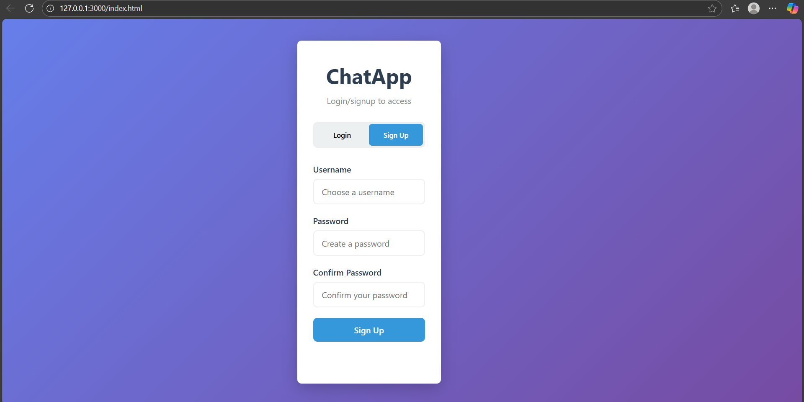

# 💬 Chat Application

A real-time chat application built with **Spring Boot**, **MongoDB Atlas**, and **HTML/CSS/JavaScript**.  
This project demonstrates full-stack development with a secure backend, responsive frontend, and cloud database integration.

---

## 🚀 Features
- **Real-time Messaging** using WebSockets
- **User Authentication using JWT & Session Management** for secure communication
- **Responsive UI** built with HTML, CSS, and Vanilla JavaScript
- **Cloud Database** with MongoDB Atlas for storing users and chat history
- **REST APIs** for user management and message handling

---

## 🛠️ Tech Stack
- **Backend:** Spring Boot (Java), WebSockets, REST API
- **Frontend:** HTML, CSS, JavaScript
- **Database:** MongoDB Atlas (Cloud)
- **Build Tool:** Maven

---
## 📷 Screenshots

---
> ⚠️ **Note:**  
> The `application.properties` file is not included in this repository for security reasons.  
> To run the project, create your own `application.properties` file in  
> `src/main/resources/` and configure it with your **MongoDB Atlas URI** and other environment-specific settings.